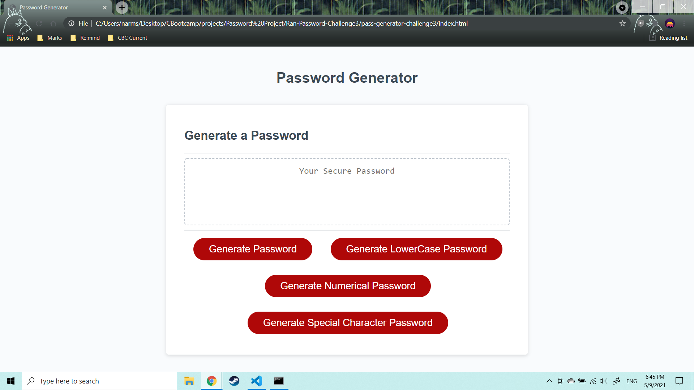

## Password Generator Starter Code

# Description
The Password Generator creates random passwords. It allows the user to enter their criteria for passwords (i.e. lowercase, uppercase, numeric, special characters) and then create said password. The password will be between 8 - 128 characters.

# Screenshot

# Website
https://narmstrongv.github.io/pass-generator-challenge3/
